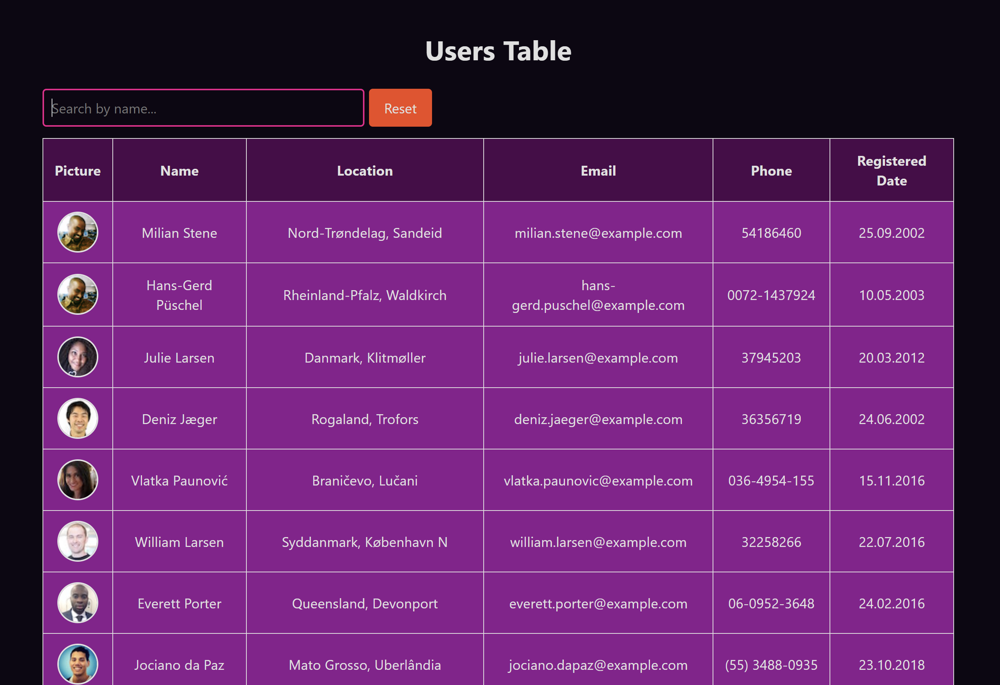

# Таблица пользователей с фильтрацией по имени



## Особенности

- **Таблица пользователей** - отображает информацию о пользователях: аватар, имя, локация, почта, телефон, дата регистрации
- **Фильтрация на клиенте** - фильтр по имени и фамилии пользователя
- **Индикатор загрузки** - отображает состояние загрузки во время получения данных
- **Тултип к изображению** - при наведении курсора на аватар пользователя можно увидеть увеличенную версию
- **Функция debounce** - предотвращает лишние перерисовки при вводе, откладывая выполнение фильтрации до завершения ввода пользователя
- **Форматирование дат** - даты в таблице отображаются в формате `dd.MM.yyyy`
- **Обработка ошибок**:
  - при ошибке загрузки пользователей выводится сообщение в консоль
  - при ошибке загрузки аватара используется изображение по умолчанию
  - при ошибке загрузки изображения в тултипе отображается сообщение об ошибке

## API
Данные загружаются с [Random User API](https://randomuser.me/api/?results=15)

## Стек
- **React**
- **TypeScript**
- **CSS Modules**
- **Vite**

## Структура проекта

- **api/** - функции для работы с API
- **assets/** - статические ресурсы (изображения, иконки)
- **components/** - React-компоненты
- **types/** - TypeScript типы
- **utils/** - вспомогательные функции (например, debounce)

## Установка и запуск
```bash
# Установка зависимостей
npm install

# Запуск в режиме разработки
npm run dev
```